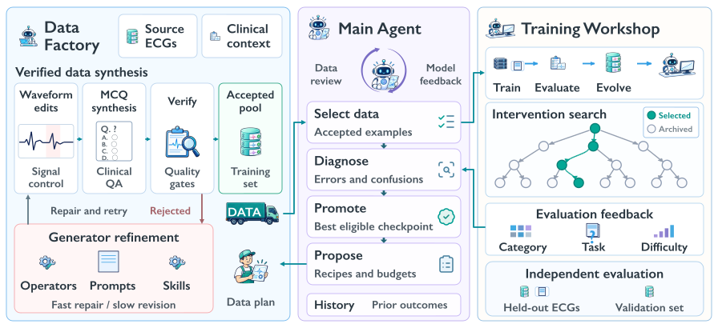
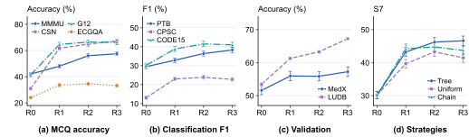
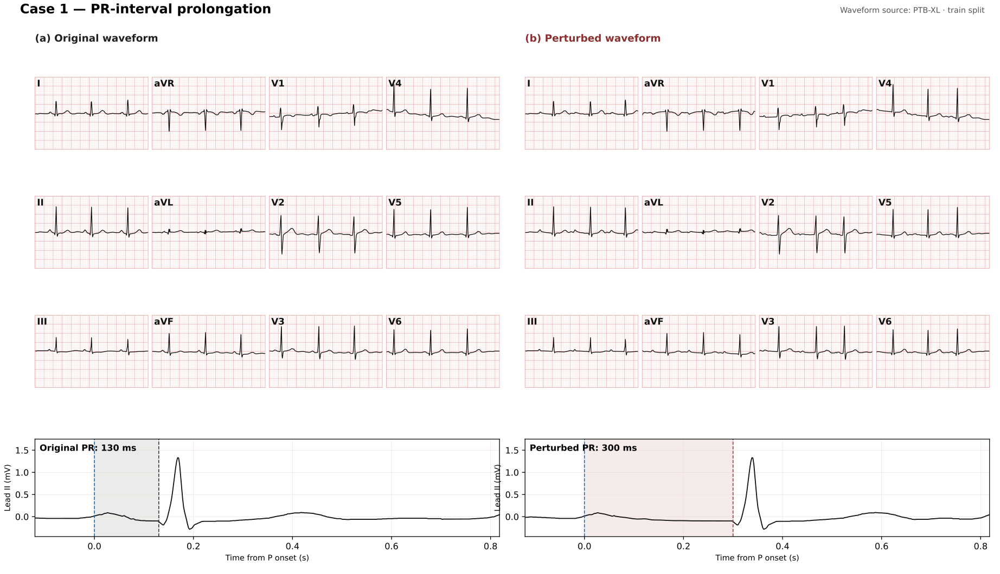
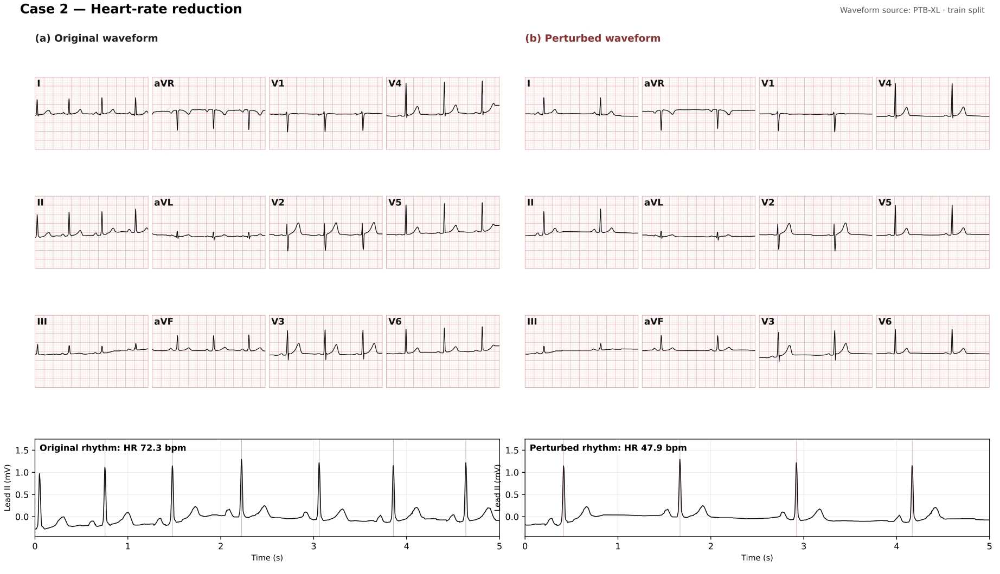

<div align="center">

# ECG-RSI: Recursive Self-Improvement<br>through Targeted ECG Waveform Evolution

Wang Xiaoliang, Zhuo Chen, Chuanyang Zheng, Jiangwei Lao, Quanbin Wang, Honglin Lin, Jiajia Liu, Zhihong Lu, Hao Jin, Jian Wang, Lijun Wu

Zhejiang University · Ant Group · Shanghai Artificial Intelligence Laboratory · Shanghai Jiao Tong University

**Updated 9 October 2026** · 30-page manuscript

[**Paper (PDF)**](ecg-rsi.pdf) · [**Project Website**](https://pork-pay.github.io/ECG-RSI/) · [**LaTeX / Overleaf Source**](ECG_RSI_arXiv.zip)

</div>

## Overview

ECG-RSI connects targeted ECG instruction-data synthesis with feedback-driven model improvement. The forward route derives questions and explanations from real training-side waveforms. The reverse route translates a desired feature contrast into constrained waveform edits, remeasures the resulting signal, and constructs supervision from the achieved evidence.

Two feedback loops connect this data engine to learning: **construction feedback** guides operator and prompt repair, while **learner feedback** specifies which capabilities, difficulty levels, and evidence representations to construct next. Target attainment and non-target preservation jointly constrain data acceptance.



The current manuscript reports mean gains of **21.47 percentage points in QA accuracy** and **9.77 points in classification F1** across R0–R3.

## Highlights

- **Reverse waveform perturbation.** Turn requested ECG feature changes into paired, measurable waveform interventions.
- **Bidirectional signal–instruction synthesis.** Generate supervision from observed signals or construct missing feature contrasts and verify the resulting evidence.
- **Dual feedback.** Repair construction failures and adapt the next data recipe to the learner’s errors.
- **Iterative improvement.** S7 on ECGBench increases from **30.15 to 46.61** after three iterations, a **16.46-point gain**.

## Results

| Round | MMMU Acc. | CSN Acc. | G12 Acc. | ECGQA Acc. | PTB F1 | CPSC F1 | CODE15 F1 | S7 |
|---|---:|---:|---:|---:|---:|---:|---:|---:|
| R0 | 42.00 | 30.91 | 41.36 | 23.99 | 29.50 | 13.10 | 30.20 | 30.15 |
| R1 | 48.00 | 61.68 | 64.61 | 33.56 | 32.90 | 23.00 | 38.80 | 43.22 |
| R2 | 56.00 | 64.86 | 66.39 | 34.55 | 36.40 | 23.90 | 41.50 | 46.23 |
| R3 | 57.50 | 67.23 | 66.24 | 33.18 | 38.30 | 22.80 | 41.00 | **46.61** |

All scores are on a 0–100 scale. S7 is the equal-weight mean of four accuracy and three F1 scores. Individual metrics do not necessarily improve monotonically.



## Method

1. **Diagnose:** identify errors by category, question type, and difficulty on the feedback set.
2. **Construct and validate:** retrieve or edit training-side ECGs, remeasure them, and check question–evidence consistency.
3. **Train candidates:** A/B/C branches start from the same parent, reuse historical data, and each add 10,000 accepted questions.
4. **Promote and repeat:** compare candidates on a separate development selection set and retain the best qualifying update.

The language model is trainable; the vision encoder and multimodal aligner are frozen. Each branch trains for three epochs. Detailed protocols and hyperparameters are in the manuscript.

## Waveform examples

### PR prolongation

Target PR: 300 ms. Remeasured PR: 298 ms, with HR 74.6 bpm.



### Heart-rate slowing

Target HR: 48 bpm. Remeasured HR: 47.9 bpm. The construction extends the TP segment while preserving the P–QRS–T segment.



These are examples under the paper’s automatic closed-loop measurement convention. The manuscript separately reports blinded review by experienced human practitioners.

## Available materials

| Material | Location |
|---|---|
| Expanded manuscript | [PDF](ecg-rsi.pdf) |
| Editable manuscript source | [Overleaf ZIP](ECG_RSI_arXiv.zip) |
| Project website | [GitHub Pages](https://pork-pay.github.io/ECG-RSI/) |
| Figures and waveform examples | Image files in this repository |

This repository currently contains the manuscript and project-page materials. Training and synthesis implementation code is not included in this release.

## Local website preview

```bash
python3 -m http.server 8000
```

Open http://localhost:8000/. To compile the manuscript, unzip `ECG_RSI_arXiv.zip`, enter `ECG_RSI_arXiv`, and run `latexmk -pdf main.tex` (pdfLaTeX and BibTeX). The source package includes the current bibliography style and generated `main.bbl`. References follow the main text and precede the appendix.

## Citation

Wang Xiaoliang, Zhuo Chen, Chuanyang Zheng, Jiangwei Lao, Quanbin Wang, Honglin Lin, Jiajia Liu, Zhihong Lu, Hao Jin, Jian Wang, and Lijun Wu. **ECG-RSI: Recursive Self-Improvement through Targeted ECG Waveform Evolution.** 2026. [Manuscript](ecg-rsi.pdf).

Layout revision (9 October 2026): Table 9 is a narrow right-wrapped table. Pagination and case-study figure placement were adjusted to remove large page-bottom gaps; the complete manuscript is 32 pages. References remain before the appendix.

Cross-round insight: error diagnosis motivates candidate interventions, while candidate comparison selects the update. The retained A–B–B path is consistent with changing intervention utility, but learner state and recipe content vary together. Continued local correction yields diminishing external S7 gains, motivating transfer and regression checks.

The current revision removes the duplicated Figure 3 title, adds editorial emphasis to both complete case transcripts, and includes seven recent RSI papers verified against arXiv records (60 references in total).

Recipe-selection clarification (9 October 2026): Section 3.3.2 explains how A changes category/task quotas, B builds confusion-focused options and explanations, and C reweights difficulty/task mixtures. Section 3.3.3 specifies matched same-parent training and selection on a separate development set. Figure 3 is schematic; Table 13 reports actual mixtures, scores, and retained branches.

Appendix readability update (9 October 2026): purple topic headings, blue identifiers and key terms, and bold actions distinguish the method details, prompt fields, and case subsections. The wording, formulas, experimental values, and 32-page length are unchanged.
